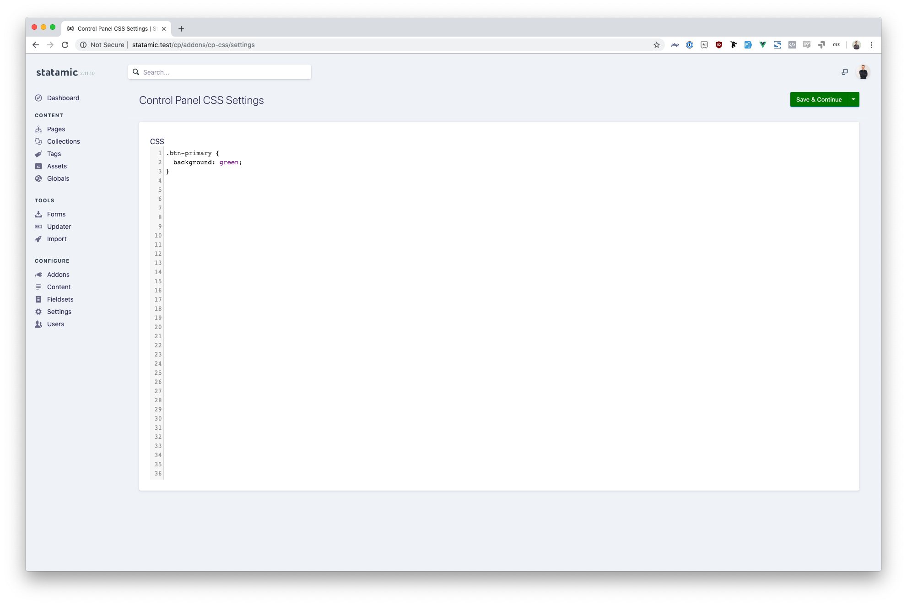

# Control Panel CSS addon for Statamic

Add custom CSS to your control panel.

*Note*: You do not need an addon to do this, see [https://docs.statamic.com/control-panel#customizing-the-stylesheet](https://docs.statamic.com/control-panel#customizing-the-stylesheet), but sometimes it's just easier to do it in the Control Panel

## Installation

To install the plugin, download the plugin and place it in your `site/addons` folder.

## Using CpCss

Add CSS to the plugin settings.

Brought to you by [Rias](https://rias.be)
